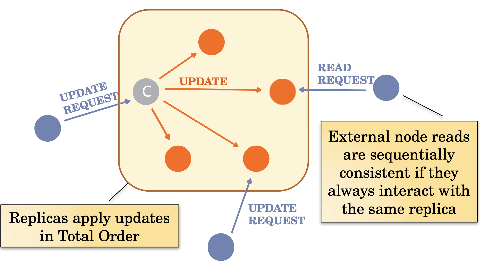

# Quorum Based Total Order Broadcast

This project is aimed at implementing a protocol Total Order Broadcast (or Atomic Broadcast) that
relies on a coordinator and a quorum of nodes. This project is inspired by [Apache ZooKeeper](https://zookeeper.apache.org), a
service for the configuration and coordination of
distributed applications.

There are two main components:
- Two-phase broadcast (with a quorum)
- Coordinator election (on a ring)



# Project Structure

The project is structured as follows:
- `src/` contains the source code
- `src/classes` contains the classes that implements clients and cohorts
- `src/loggers` contains methods to log system state
- `src/messages` contains all messages class that are exchanged in the system
- `src/tests` contains the test cases for the system
- `src/tools` contains general tools

# Requirements

- Java
- Gradle
- JUnit 5

# How to run

Firstly clone the repository:

```bash
git clone https://github.com/StefanoSacchet/QuorumBasedTotalOrderBroadcast.git
```

Then, navigate to the `config` directory and create a .env file following the structure of the `.env.example` file.

Finally, run the `Main` class.
